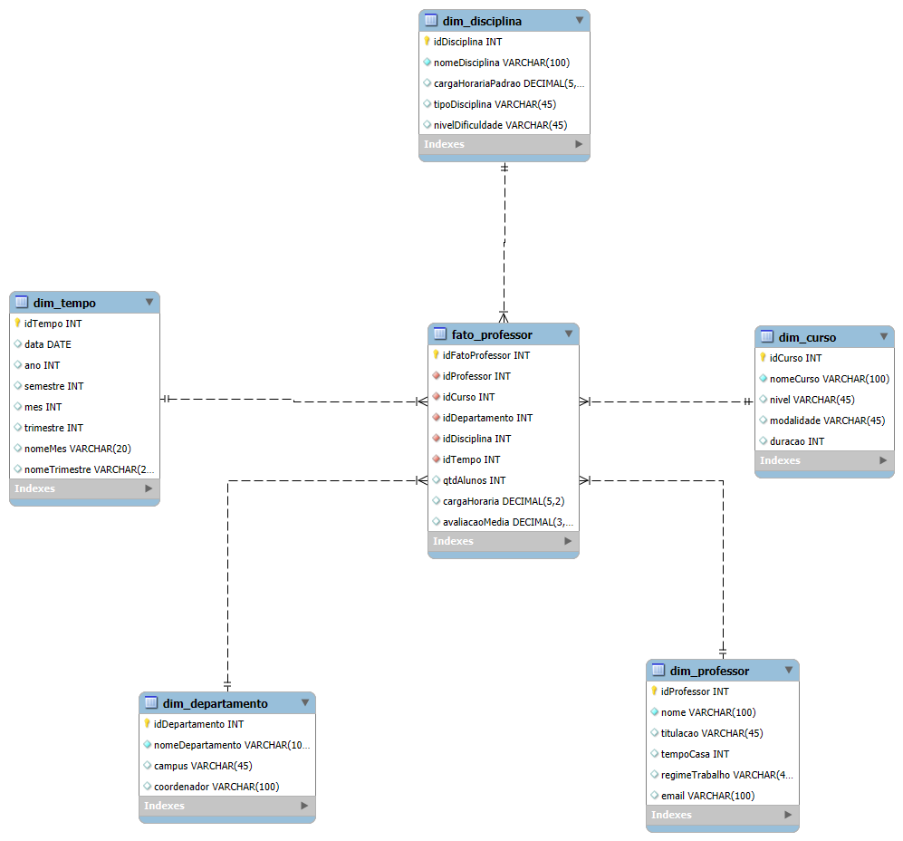

# 🎓 Modelo Dimensional (Star Schema) - Universidade

## 📘 Descrição do Projeto
Este projeto apresenta a modelagem **dimensional (Star Schema)** de uma **base de dados universitária**, com foco na **análise de professores**.  
O objetivo é transformar o modelo relacional original em um **modelo analítico** otimizado para consultas de Business Intelligence (BI) e Data Warehouse.

O modelo foi implementado e validado em **MySQL Workbench**, utilizando **tabelas InnoDB** com relacionamentos 1:N e chaves estrangeiras ativas.

---

## 🧩 Modelo Relacional Original
O modelo relacional (OLTP) possuía várias entidades operacionais, como:

- **Professor**, **Departamento**, **Curso**, **Disciplina**, **Aluno**, **Matrícula**  
- Relacionamentos complexos (muitos para muitos)
- Estrutura normalizada (3FN)

Esse modelo é adequado para sistemas transacionais, mas **não ideal para análise de dados**.

---

## 🌟 Transformação em Modelo Estrela (Star Schema)

### 🎯 Foco analítico: **Professor**

A modelagem dimensional foi criada para permitir análises como:
- Quantas disciplinas cada professor ministra por semestre  
- Média de alunos por disciplina  
- Carga horária total ministrada por professor  
- Desempenho médio por curso, departamento e período

---

## 🏗️ Estrutura do Star Schema

### 🧱 Tabela Fato: `fato_professor`

| Campo | Descrição |
|--------|------------|
| **idFatoProfessor** | Chave primária (técnica) |
| **idProfessor** | FK → Dim_Professor |
| **idCurso** | FK → Dim_Curso |
| **idDepartamento** | FK → Dim_Departamento |
| **idDisciplina** | FK → Dim_Disciplina |
| **idTempo** | FK → Dim_Tempo |
| **qtdAlunos** | Quantidade de alunos na disciplina |
| **cargaHoraria** | Carga horária ministrada |
| **avaliacaoMedia** | Média de avaliação do professor |

---

### 🧭 Tabelas Dimensão

#### 🧑‍🏫 `dim_professor`
| Campo | Descrição |
|--------|------------|
| idProfessor | Chave primária |
| nome | Nome completo |
| titulacao | Grau acadêmico |
| tempoCasa | Tempo de casa (anos) |
| regimeTrabalho | Integral / Parcial |
| email | Contato |

#### 🏛️ `dim_departamento`
| Campo | Descrição |
|--------|------------|
| idDepartamento | Chave primária |
| nomeDepartamento | Nome do departamento |
| campus | Localização |
| coordenador | Nome do coordenador |

#### 🎓 `dim_curso`
| Campo | Descrição |
|--------|------------|
| idCurso | Chave primária |
| nomeCurso | Nome do curso |
| nivel | Graduação / Pós |
| modalidade | Presencial / EAD |
| duracao | Duração em semestres |

#### 📚 `dim_disciplina`
| Campo | Descrição |
|--------|------------|
| idDisciplina | Chave primária |
| nomeDisciplina | Nome da disciplina |
| cargaHorariaPadrao | Carga horária base |
| tipoDisciplina | Teórica / Prática |
| nivelDificuldade | Básica / Intermediária / Avançada |

#### 🗓️ `dim_tempo`
| Campo | Descrição |
|--------|------------|
| idTempo | Chave primária |
| data | Data de referência |
| ano | Ano |
| semestre | 1 ou 2 |
| mes | Mês |
| trimestre | Trimestre |
| nomeMes | Nome do mês |
| nomeTrimestre | Nome do trimestre |

---

## 🔗 Relacionamentos (Cardinalidades)

| Dimensão | Cardinalidade | Relação |
|-----------|----------------|----------|
| `dim_professor` | 1 : N | Um professor → vários fatos |
| `dim_curso` | 1 : N | Um curso → várias disciplinas ministradas |
| `dim_departamento` | 1 : N | Um departamento → várias ocorrências na fato |
| `dim_disciplina` | 1 : N | Uma disciplina → várias ofertas |
| `dim_tempo` | 1 : N | Um período → várias ocorrências |

🔸 Todos os relacionamentos possuem **Foreign Keys** ativas e **integridade referencial garantida**.

---

## 🧠 Granularidade
Cada registro em `fato_professor` representa:

> “Um professor ministrando uma disciplina em um curso, vinculado a um departamento, em um determinado período.”

---

## 🧰 Tecnologias Utilizadas
- **MySQL Workbench 8+**
- **MySQL Server (InnoDB Engine)**
- **Modelo EER (Entity-Relationship Diagram)**
- **Reverse Engineer e Model Validation**

---

## 📊 Diagrama Star Schema



---

## 🧩 Consultas Analíticas Exemplos

```sql
-- 1️⃣ Total de alunos por professor
SELECT p.nome, SUM(f.qtdAlunos) AS total_alunos
FROM fato_professor f
JOIN dim_professor p ON f.idProfessor = p.idProfessor
GROUP BY p.nome;

-- 2️⃣ Carga horária total por departamento
SELECT d.nomeDepartamento, SUM(f.cargaHoraria) AS total_horas
FROM fato_professor f
JOIN dim_departamento d ON f.idDepartamento = d.idDepartamento
GROUP BY d.nomeDepartamento;

-- 3️⃣ Média de avaliação por curso e semestre
SELECT c.nomeCurso, t.ano, t.semestre, AVG(f.avaliacaoMedia) AS media
FROM fato_professor f
JOIN dim_curso c ON f.idCurso = c.idCurso
JOIN dim_tempo t ON f.idTempo = t.idTempo
GROUP BY c.nomeCurso, t.ano, t.semestre;
